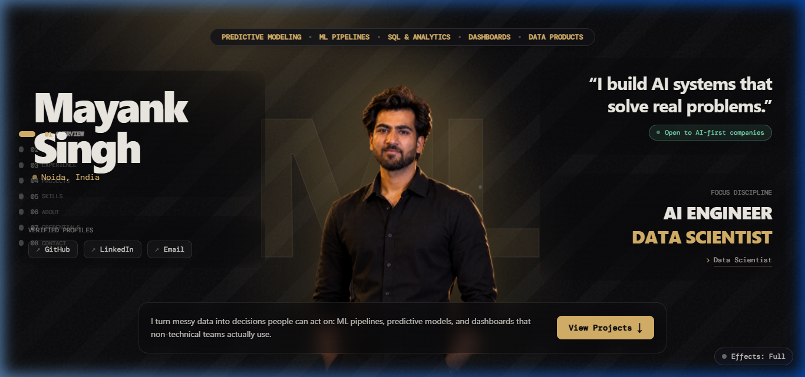

<!-- 🎬 HERO — Viewfinder HUD + Animated Gradient Name + Cycling Roles -->

  

## 🌐 My Portfolio Website

> **Explore the interactive web portfolio:** A modern, high-performance web experience showcasing systems architecture, model pipelines, engineering case studies, and interactive telemetry.

&nbsp;

 

 
⚡ Click the preview above to launch the live portfolio at <a href="https://mayank-portfolio-xi-wheat.vercel.app/">mayank-portfolio-xi-wheat.vercel.app</a>

  

<!-- 🧠 DUAL CARDS: AI Systems & Architecture • Project Carousel & Telemetry -->

  

<!-- ⚛️ TECH STACK — Orbiting Systems & Sequential Glowing Chips -->

  

<!-- 🪪 DEVELOPER ID BADGE + ANALYTICS DASHBOARD -->

  

---

## 🚀 Flagship Engineering Projects

### 🛡️ [Tollgate — Multi-Tenant LLM Gateway](https://github.com/mayanksingh2745/Tollgate-a-multi-tenant-LLM-gateway-with-budgets-semantic-caching-and-cost-quality-routing)
> **Production-grade AI gateway architecture designed to eliminate runaway inference expenses, enforce hard multi-tenant spending limits, and maintain microsecond-level routing efficiency.**

* **OpenAI-Compatible Proxy**: Drop-in `/v1/chat/completions` gateway supporting official OpenAI SDKs, with streaming (SSE) and non-streaming modes.
* **Multi-Tenancy & Security**: Tenant & Project hierarchy with RBAC (`owner`, `admin`, `viewer`) and constant-time SHA-256 hashed API key validation.
* **Two-Phase Atomic Budgets**: Multi-scope spending limits (daily/monthly per project/tenant) enforced via integer microdollar arithmetic ($1.00 = 1,000,000 microdollars) with pre-request reservation and idempotent settlement.
* **Semantic Vector Caching**: Embedding similarity search powered by Redis & vector indexing, delivering sub-20ms cache responses on recurring prompts.
* **Provider Reliability & Failover**: Automatic failover chains, exponential backoff with bounded jitter, and intelligent cost-quality model routing.
* **Enterprise Observability**: Distributed tracing with Jaeger, Prometheus telemetry metrics, Grafana dashboards, and a dedicated React monitoring interface.
* **Verified Technologies**: `Python 3.11+` · `FastAPI` · `AsyncPG` · `PostgreSQL` · `pgvector` · `Redis` · `Redis Streams` · `Docker Compose` · `Alembic` · `React` · `Prometheus` · `Jaeger`.

---

### 🔬 [SQLForge — Empirical Study: What Fine-Tuning Buys on Text-to-SQL](https://github.com/mayanksingh2745/SQLForge-a-controlled-study-of-what-fine-tuning-buys-on-text-to-SQL)
> **A rigorous, controlled research benchmark investigating whether parameter-efficient fine-tuning (LoRA / QLoRA) on small open-weight language models matches frontier commercial APIs on text-to-SQL execution accuracy.**

* **Core Scientific Objective**: Measures whether 1.5B–8B parameter open models (e.g., Qwen2.5-Coder-7B) can approach or match commercial frontier reference APIs (GPT-4o mini, Claude 3.5 Sonnet) on SQL execution accuracy (EX) while minimizing latency and VRAM footprint.
* **Controlled Experimental Framework**: Direct empirical comparison between zero-shot base prompting, schema-aware few-shot prompting, dynamic similarity-retrieved few-shot, and LoRA/QLoRA adaptation.
* **Multi-Benchmark Rigor**: Evaluated across Spider, a harder BIRD subset, and a completely held-out custom SaaS schema to quantify out-of-domain transfer and schema nesting retention.
* **Contamination & Leakage Audit**: Strict n-gram and semantic similarity verification to prevent test set data leakage into training splits.
* **Implementation Status**: Completed architecture, packaging, dataset pipelines, prompt templates, contamination detection, and evaluation harness (Steps 0–6); LoRA hyperparameter and rank scaling sweeps ($r \in \{8, 16, 32, 64\}$) actively underway.
* **Verified Technologies**: `Python 3.11+` · `PyTorch` · `Hugging Face Transformers` · `PEFT` · `BitsAndBytes (NF4)` · `vLLM` · `Spider Benchmark` · `Ruff` · `mypy`.

---

## ⚡ Complete Engineering Portfolio

| Project | Architecture &amp; Focus | Core Stack | Status |
|:---|:---|:---|:---:|
| [**Tollgate**](https://github.com/mayanksingh2745/Tollgate-a-multi-tenant-LLM-gateway-with-budgets-semantic-caching-and-cost-quality-routing) | Multi-tenant LLM gateway with strict token budgets, vector semantic caching (14ms hit), and intelligent cost-quality model routing | `Python` `FastAPI` `Redis` `PostgreSQL` `Docker` | 🟢 Active |
| [**SQLForge**](https://github.com/mayanksingh2745/SQLForge-a-controlled-study-of-what-fine-tuning-buys-on-text-to-SQL) | Rigorous empirical benchmark measuring execution accuracy, schema adaptation, and cost trade-offs of parameter-efficient fine-tuning on Text-to-SQL | `PyTorch` `LoRA / QLoRA` `Transformers` `vLLM` | 🔬 Research |
| [**Digital Twin for Predictive Maintenance**](https://github.com/mayanksingh2745/ValueTrack-Customer-Lifetime-Value-Predictor) | Industrial time-series forecasting engine with stacked LSTMs and 3D tensor windowing on 10-year streaming telemetry for predictive anomaly detection | `Python` `Stacked LSTM` `Scikit-learn` `Streamlit` | ⚙️ Research |
| [**TechTutor**](https://github.com/mayanksingh2745/TechTutor-Domain-Specific-LLM-Fine-Tuning-LoRA) | Domain-specific LLM fine-tuning of Mistral-7B leveraging LoRA/QLoRA for high-accuracy technical education and machine learning comprehension | `Mistral-7B` `LoRA` `PEFT` `HuggingFace` | 🚀 Released |
| [**DocuMind**](https://github.com/mayanksingh2745/DocuMind-RAG-Powered-Document-Q-A-System) | End-to-end Retrieval-Augmented Generation (RAG) system with semantic chunking, FAISS vector indexing, and grounded multi-format document Q&amp;A | `LangChain` `FAISS` `FastAPI` `Python` | 🚀 Released |
| [**Project Velocity**](https://github.com/mayanksingh2745/Project-Velocity-Automotive-Sales-Market-Intelligence-Platform) | End-to-end automotive market intelligence platform forecasting performance and demand using ensemble machine learning | `Python` `Ensemble ML` `Pandas` `SQL` | 🚀 Released |

 

## 🌃 3D Contribution City

*Every commit builds another tower — rebuilt automatically every day.*

  

<!-- 💌 LET'S CONNECT -->

 

&nbsp;

&nbsp;

&nbsp;

  

 

**Engineering practical intelligence. Always learning, always building.** ⚡

