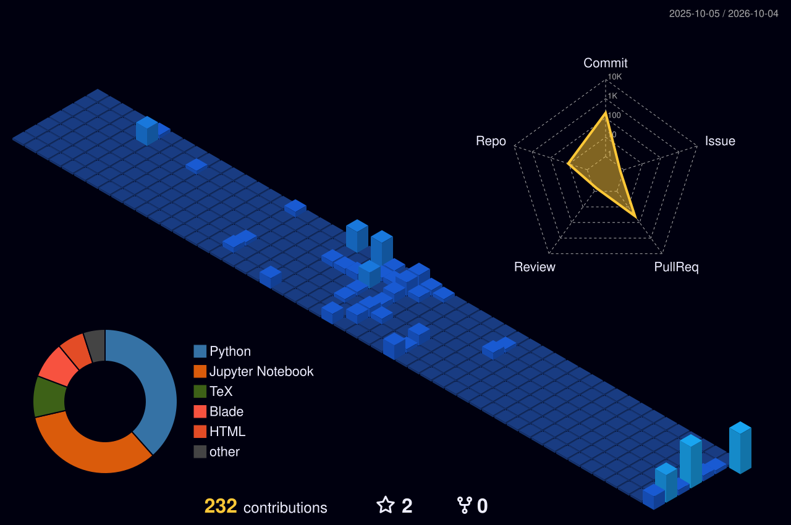

<!-- 🎬 HERO — Viewfinder HUD + Animated Gradient Name + Cycling Roles -->

  

<!-- 🧠 DUAL CARDS: AI Systems & Architecture • Project Carousel & Telemetry -->

  

<!-- ⚛️ TECH STACK — Orbiting Systems & Sequential Glowing Chips -->

  

<!-- 🪪 DEVELOPER ID BADGE + ANALYTICS DASHBOARD -->

  

## ⚡ Featured Engineering Projects

| Project | Architecture &amp; Focus | Core Stack | Status |
|:---|:---|:---|:---:|
| [**Tollgate**](https://github.com/mayanksingh2745/Tollgate-a-multi-tenant-LLM-gateway-with-budgets-semantic-caching-and-cost-quality-routing) | Multi-tenant LLM gateway with strict token budgets, vector semantic caching (14ms hit), and intelligent cost-quality model routing | `Python` `FastAPI` `Redis` `PostgreSQL` `Docker` | 🟢 Active |
| [**SQLForge**](https://github.com/mayanksingh2745/SQLForge-a-controlled-study-of-what-fine-tuning-buys-on-text-to-SQL) | Rigorous empirical benchmark measuring execution accuracy, schema adaptation, and cost trade-offs of parameter-efficient fine-tuning on Text-to-SQL | `PyTorch` `LoRA / QLoRA` `Transformers` `vLLM` | 🔬 Research |
| [**Digital Twin for Predictive Maintenance**](https://github.com/mayanksingh2745/ValueTrack-Customer-Lifetime-Value-Predictor) | Industrial time-series forecasting engine with stacked LSTMs and 3D tensor windowing on 10-year streaming telemetry for predictive anomaly detection | `Python` `Stacked LSTM` `Scikit-learn` `Streamlit` | ⚙️ Deployed |
| [**TechTutor**](https://github.com/mayanksingh2745/TechTutor-Domain-Specific-LLM-Fine-Tuning-LoRA) | Domain-specific LLM fine-tuning of Mistral-7B leveraging LoRA/QLoRA for high-accuracy technical education and machine learning comprehension | `Mistral-7B` `LoRA` `PEFT` `HuggingFace` | 🚀 Released |
| [**DocuMind**](https://github.com/mayanksingh2745/DocuMind-RAG-Powered-Document-Q-A-System) | End-to-end Retrieval-Augmented Generation (RAG) system with semantic chunking, FAISS vector indexing, and grounded multi-format document Q&amp;A | `LangChain` `FAISS` `FastAPI` `Python` | 🚀 Released |
| [**Project Velocity**](https://github.com/mayanksingh2745/Project-Velocity-Automotive-Sales-Market-Intelligence-Platform) | End-to-end automotive market intelligence platform forecasting performance and demand using ensemble machine learning | `Python` `Ensemble ML` `Pandas` `SQL` | 🚀 Released |

 

## 🌃 3D Contribution City

*Every commit builds another tower — rebuilt automatically every day.*

  

<!-- 💌 LET'S CONNECT -->

 

&nbsp;

&nbsp;

  

 

**Engineering practical intelligence. Always learning, always building.** ⚡

